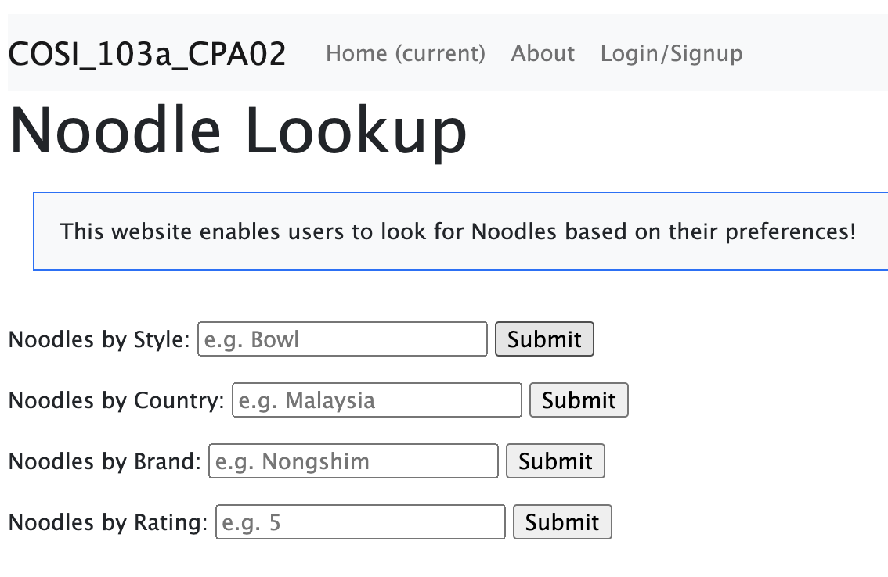
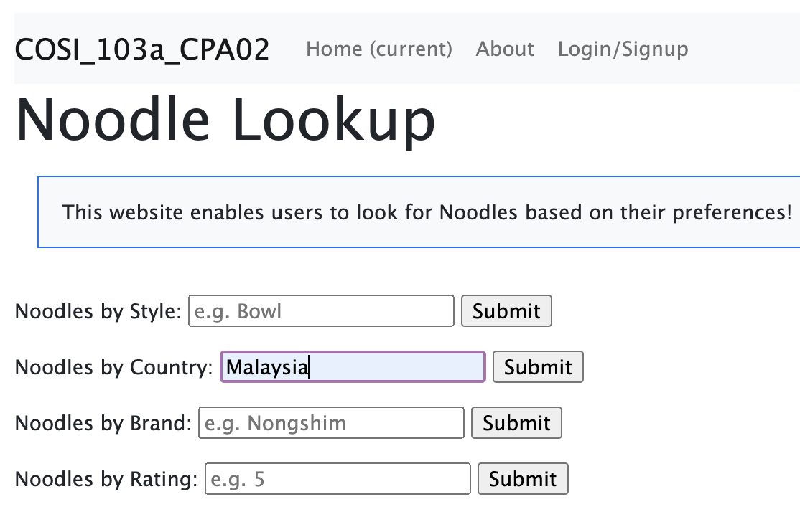
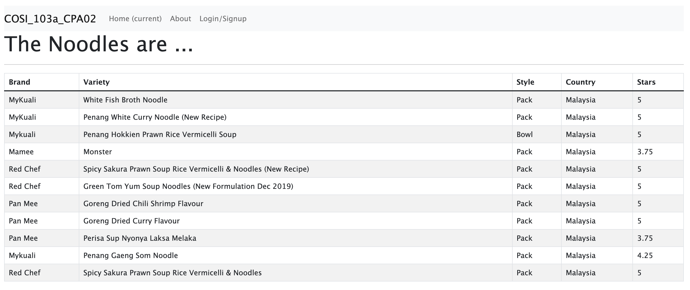

# CS103a CPA02

This application is a noodle search application for various noodles in the world taken from a particular dataset. It was implemented from the base application found [here](https://github.com/tjhickey724/cs103aExpressApp/tree/pa03). It has been extended such that it now upserts the DB with an array of `String` times, and a new noodle search form/route that searches by style, country, brand, and ratings.. Lastly, it has been updated to use a flexbox display instead of an `ol` list to display the resulting courses from a query.

The user starts off with the following page: 



Then the user can filter through the database to find a particular category of noodles. For example, let's say the user wants to look for all the noodles that are manufactured in Malaysia:



Finally, the user will be rendered results that will look the following table:




## Where to Download From?

to download this code, run the following command:

```bash
git clone git@github.com:zuhaeerislam/cosi103_final.git
```

N.B. you must login with your SSH passphrase

## Installation

cd into the folder

Install the packages with
``` bash
npm install
```
Start the project with
``` bash
node app.js
```
or install nodemon (the node monitoring app) with
``` bash
npm install -g nodemon
```
and start the project with
``` bash
nodemon
```

